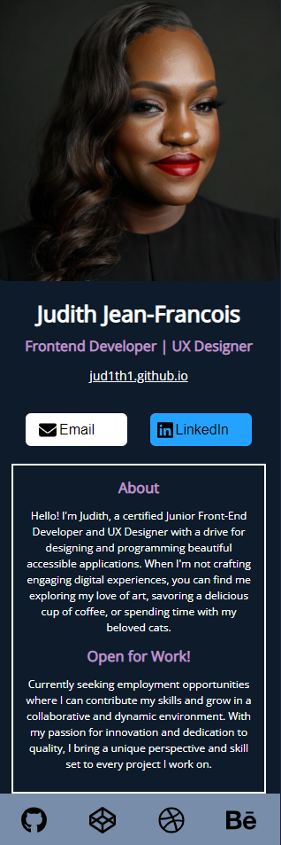

# Scrimba-Digital-Business-Card
Created with CodeSandbox

## Table of contents

- [Overview](#overview)
  - [The challenge](#the-challenge)
  - [Screenshot](#screenshot)
  - [Links](#links)
- [My process](#my-process)
  - [Built with](#built-with)
  - [What I learned](#what-i-learned)
  - [Continued development](#continued-development)

## Overview
Created a digital business card with Scrimba

### The challenge

Users should be able to:

- Learn more about me with a brief bio, profile image, and links to my social site and project upload spaces.
-	Click on my website link to access my portfolio with Github
-	Click on the LinkedIn button to find me on LinkedIn
-	Click on the footer images (Github, Codepen, Dribbble, and Behance) to access my project pages

### Screenshot

### Links

- Solution URL: https://github.com/Jud1th1/Scrimba-Digital-Business-Card
- Live link: https://csb-om8vfv.netlify.app/

## My process
- Learning React: I began by taking several lessons on Scrimba to familiarize myself with React and its core concepts.
- Project Setup: To streamline the project setup process, I opted to use CodeSandbox, which already includes React in one of its templates. This allowed me to quickly set up the necessary files and project structure.
- Component Layout: In the App.js file, I planned and organized the various components needed for the application, including the header, main section, and footer.
- Implementing Components: Using JSX, I implemented the header component and added a profile image. This component was later exported to the App.js file.
- Main Section and Footer: I utilized the same method of programming HTML code inside JavaScript to build the main section and footer components. Once completed, these components were exported to the App.js file.
- Styling: To enhance the design, I incorporated a Google font and selected a color palette from Coolors. I focused on principles such as balance, pattern, and hierarchy when arranging the text, buttons, and icons.
- Testing and Refinement: Throughout the development process, I tested the application's functionality and made necessary adjustments to ensure a smooth user experience. 

### Built with

- React
- JSX
- HTML
- CSS
- Javascript
- Mobile design

### What I learned

-	Building this project provided me with valuable hands-on experience in using React to create a web application. 
-	I gained a deeper understanding of component-based development & JSX 

### Continued development

I plan on learning more about how to use React through other Scrimba tutorials and resources available online

